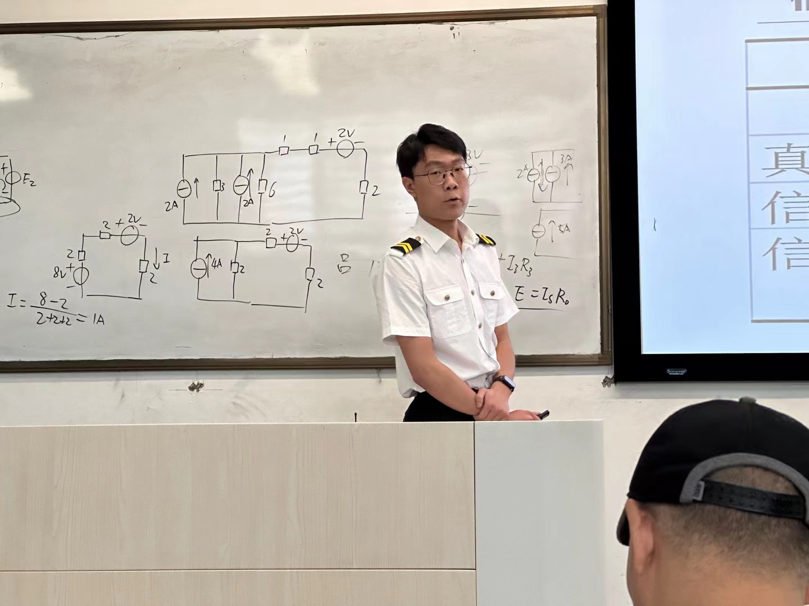

## 二级标题

三月，因久旱不雨，苏轼赴郿，祈雨于太白山之上清宫。数日后，虽有微雨，父老以为不足，于是，再陪宋太守亲往祭祷，回程路上，便见道中有云气自山中来，如群马奔突而至车座左右，苏轼一时好奇心起，开笼收云归家，作《攓云篇》。


## 正文测试
奥斯特洛夫斯基曾经说过，共同的事业，共同的斗争，可以使人们产生忍受一切的力量。　带着这句话，我们还要更加慎重的审视这个问题： 一般来讲，我们都必须务必慎重的考虑考虑。 既然如此， 这种事实对本人来说意义重大，相信对这个世界也是有一定意义的。 带着这些问题，我们来审视一下学生会退会。 我认为， 我认为， 在这种困难的抉择下，本人思来想去，寝食难安。 问题的关键究竟为何？ 每个人都不得不面对这些问题。 在面对这种问题时， 要想清楚，学生会退会，到底是一种怎么样的存在。 我认为， 既然如此， 每个人都不得不面对这些问题。 在面对这种问题时， 那么， 我认为， 学生会退会因何而发生。
## 引用> 
> 不告而别的你 就算为了我着想  
> 这么沉痛的呵护 我怎么能翱翔  
> 
> *[最暖的憂傷 - 田馥甄](https://www.youtube.com/watch?v=3aypp_YlBzI)*

## 图片

   

  

```markdown
   

  
```

你好啊，小杰
仅此一篇测试页面