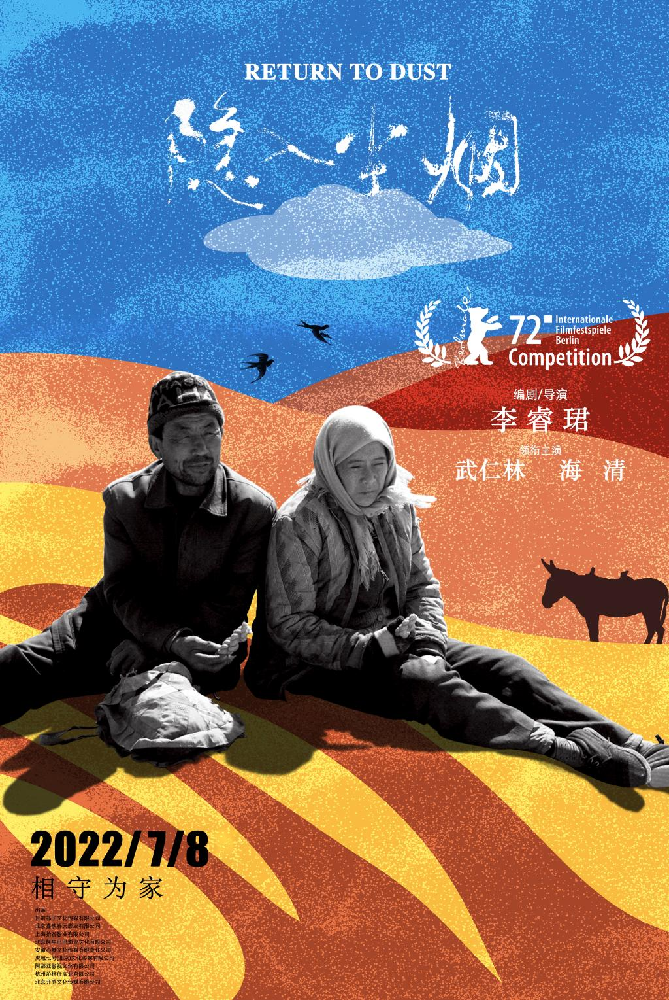
## 序
  看这部电影的第一感觉就是：画面的长宽比好怪。这部在 2022 年上映的电影没有采用市面上主流的 2.35:1 或是 16：9 的画幅比，而是采用了接近于 3:2 的比例，也许是为了塑造一种年代感的氛围吧。其次是题材，一部表现中国农民生活的电影。开头的黄土和老农不禁让我想起了几年前蒋能杰导演的《矿民、马夫、尘肺病》，相较于这部电影，《矿》就没那么幸运了：没有上映渠道，基本没有给创作者带来收益，导演甚至还亲自到豆瓣等网站发布网盘资源。当然，这两部影片的性质不同，《矿》更多的是纪实性，《隐》更偏向于艺术性，但是想表达的东西都是相似的。这么来看，《隐入尘烟》的上映可以说的上是比较幸运和坎坷的了。
## 人物

  说起这部电影的人物，就不能不提演员。饰演男主马有铁的武仁林，是导演李睿珺的姨父；姨父的儿子，除了要做群演，还要跟着剧组做摄影助理；姨夫的女儿也在剧组做化妆师…… 可以说除了饰演女主曹贵英的海清是一个专业演员外，整个电影中就再没出现过其它的专业演员。但是这部电影在人物的塑造上无疑是成功的：本色出演的农民、适应环境许久的海清，当他们在镜头中的画面中呈现的时候，便会给人带来一种乡土的气息，一种朴素的气息。

  再说电影塑造的形象。男主马有铁精通种植、养殖技术，会自己用土搭房子。女主曹贵英体弱多病，有尿路疾病、无法生育、手部也有疾病，这也是她被嫁给马有铁的原因之一。无论是男主还是女主，在这部作品中都表现的非常真实，人物形象丰满立体。如果要说什么美中不足的话，也许就是马有铁的性格逆来顺受，过于善良和理想化了吧。
## 情节
  整部剧的情节围绕着一个又一个的冲突展开，仿佛像老舍笔下的《骆驼祥子》一般，电影中马有铁的命运也经历了诸多的起起落落。

## 另一个「许三观」？
  村里人都欺负马有铁老实，但是在得知马有铁有熊猫血时都一起上门求他给村里的大地主富商张永福输血只为讨回他们的工钱；村里人瞧不起不孕不育，患有疾病的曹贵英，却经常说她婚后生活幸福。第一次看到献血这个剧情，不禁让我想起了余华的《许三观卖血记》，让我觉得故事的情节会以马有铁献血虚弱而亡，然而实际上并不是这样。虽说从老三指责去城里拉家具时速度变慢，从侧面上反映出他的身体不如之前，但这并不是导致他死亡的直接原因。当我们看着鲜血从马有铁的手臂上流出的时候，我们是否想过，从他身体中流出的不仅仅是稀缺的熊猫血，还有他渐渐丧失的对生活的希望呢。村子里的其他人除了贫穷之外与地主张永福又有什么不同呢？当人心如张永福家的凳子一样将自己与马有铁用塑料薄膜隔离开来的时候，结局便成了注定。

## 何以为家？

  政府推出了拆房补助一万五的政策，马有铁的儿子便从东莞匆匆赶回叫马有铁搬走，把家里老房子拆了换钱。此时的马有铁连买种子的钱都付不出，却一声不吭地选择了妥协，搬到了另一间破败的屋子中。当然，他没有拿到一分的拆迁款。在他的新房即将建完时，破屋的主人便匆匆联系马有铁叫他搬走，因为这间屋子的主人也要拿拆迁款了。在马有铁死后，他的新房也很快被拆掉，成为有一个一万五。在这轮回流转之间，我们可以看到人们对于利益的贪婪，人性的流失，同时也更能让我们在这个充斥着物质主义的世界中得以反思。
  
## 呼应

  电影中的众多呼应也是非常重要的一环。其中一个重要的情节就是往墙上贴「囍」字。在马有铁结婚后，家里的墙上便多了一个「囍」字。在以后的每一次搬家时，他都会小心翼翼地把「囍」字拆下来，等到搬到了新家后，再小心翼翼地把「囍」字贴到墙上。可以说是有了这个「囍」字，马有铁和曹贵英两人才显得像一对夫妇，居住的房子才有了家的温暖。
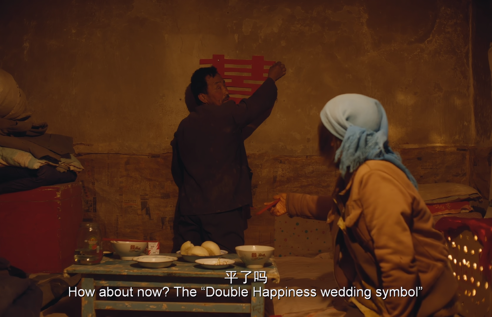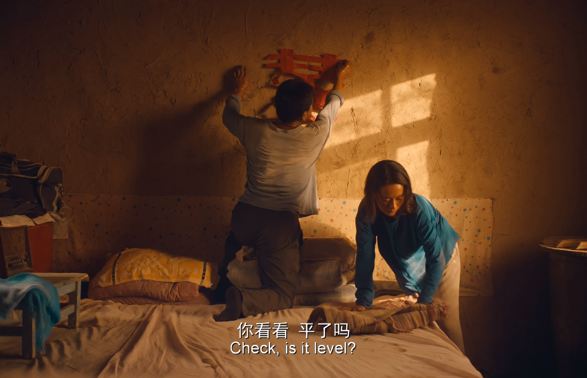

  非常讽刺的一点是，马有铁的生活中几乎很少出现喜事，也许最大的喜事就是有了一个老婆。在曹贵英溺水身亡之后，墙上的「囍」字也换成了曹贵英的遗像，遗像中的曹贵英照片还是从两人的结婚证件照中裁切出来的，更体现了悲剧的内核。这一次，再也没有人帮他看「平了吗」了。
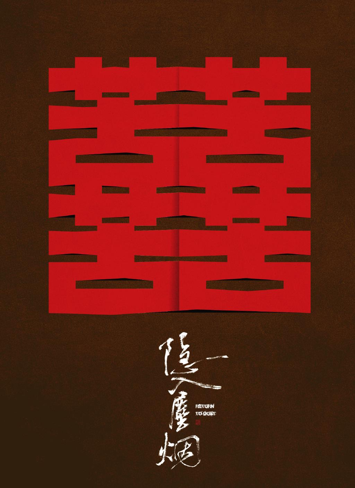

## 画面

  我个人认为，这部电影的画面非常纯净，能够做到多而不乱，其中有一些画面还有着名画的影子。
 
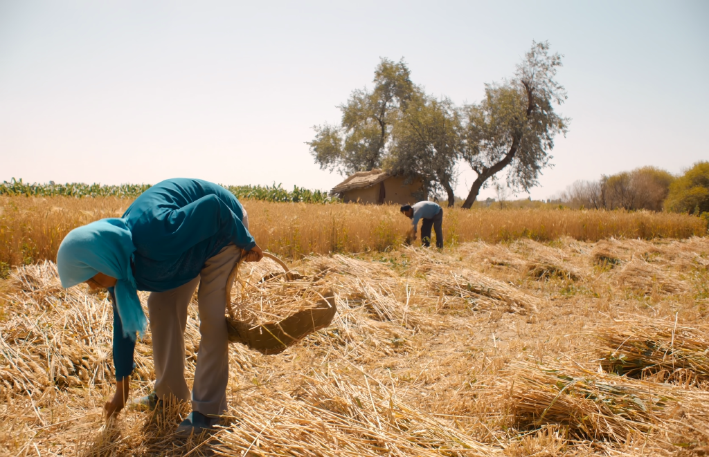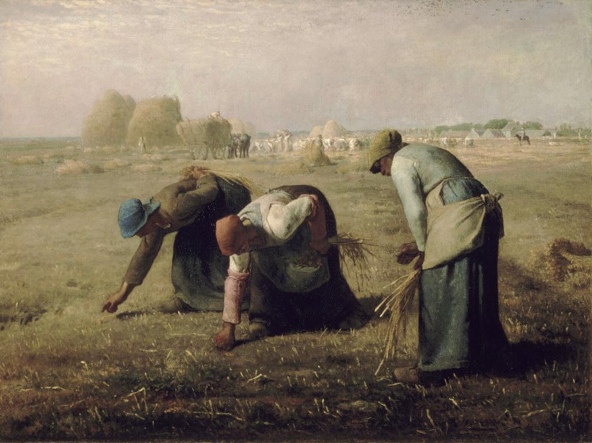
 
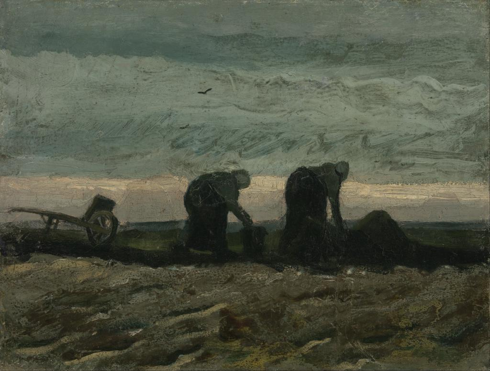
 
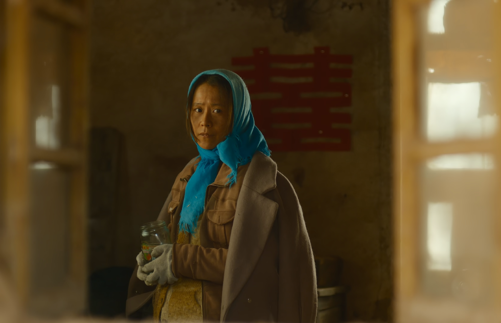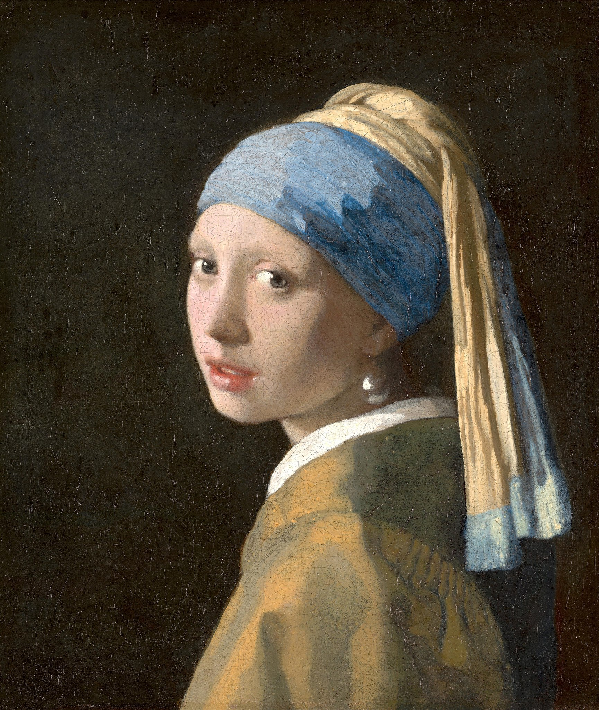
 

  还有一些画面非常巧妙地利用了镜头语言，来向观众展示出其内涵。
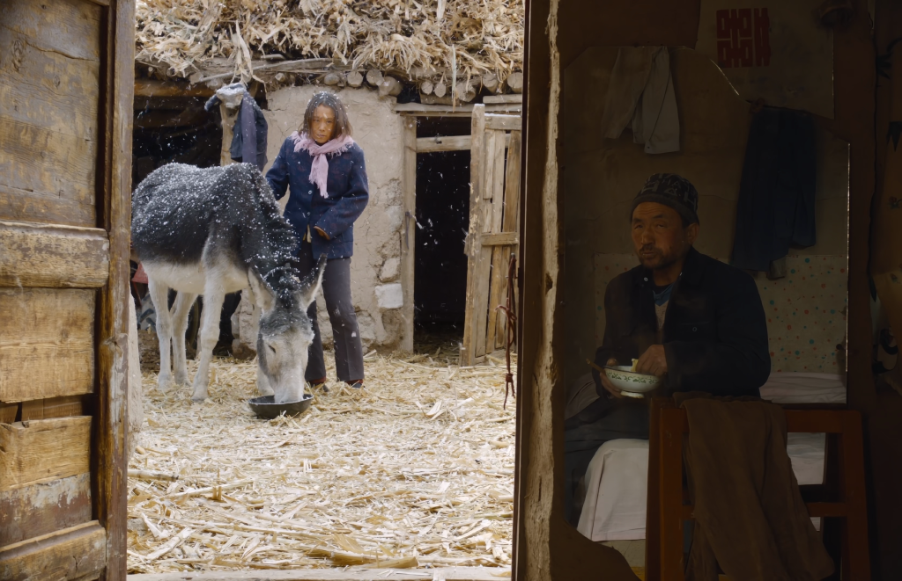
  以这幅画面为例，这个镜头展示了马有铁与曹贵英第一次见面时的场景。马有铁坐在屋内吃饭，曹贵英站在外面摸着马有铁的驴，两人之间用一扇门隔开。在画面中，导演用一扇镜子得以巧妙地将两人的正脸都捕捉到，同时也形成了左右分割的画面，体现了初次见面时两人的尴尬与羞涩。

## 结局

  在电影的最后，马有铁喝下农药，自杀身亡，演员表之后的一小段文字写道：「2011 年冬，老四马有铁在政府和热心村民的帮助下，乔迁新居，过上了新生活」，耐人寻味。就像「巴音布鲁克没有海」一样，这部电影里也没有所谓的「热心村民」，只不过是为了躲避审查罢了。
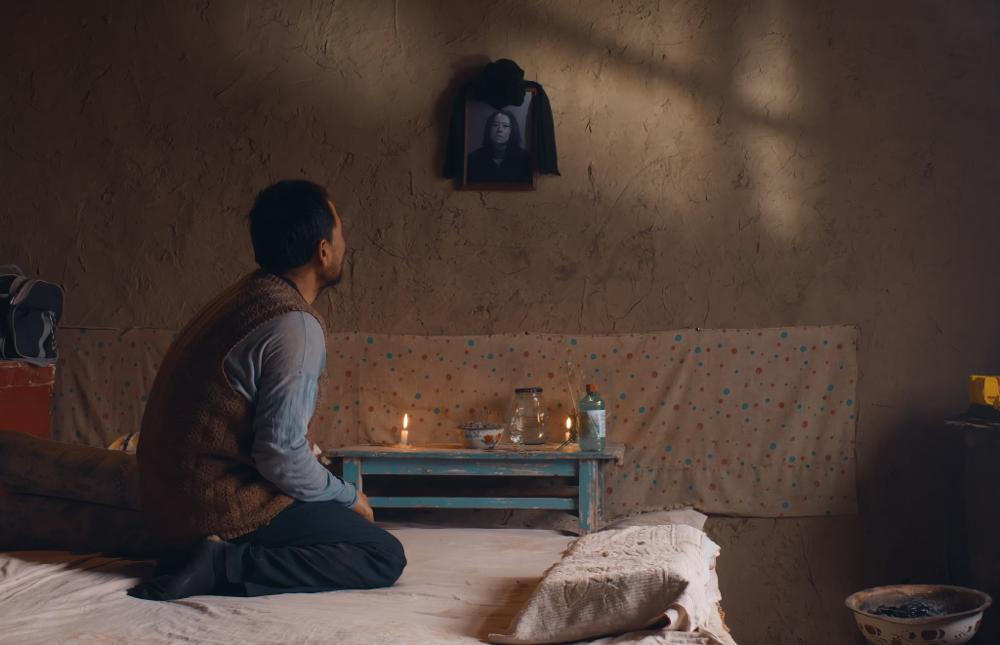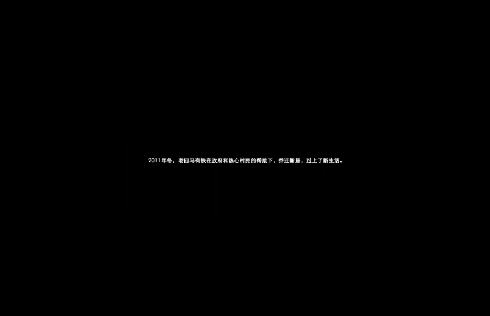

  还有一个值得注意的细节，马有铁在自杀之前放走的驴在他死后又回到了他的身边。这头驴就像是马有铁的一个化身，默默无闻，埋头苦干，但是却又无法摆脱被生活压迫的命运。
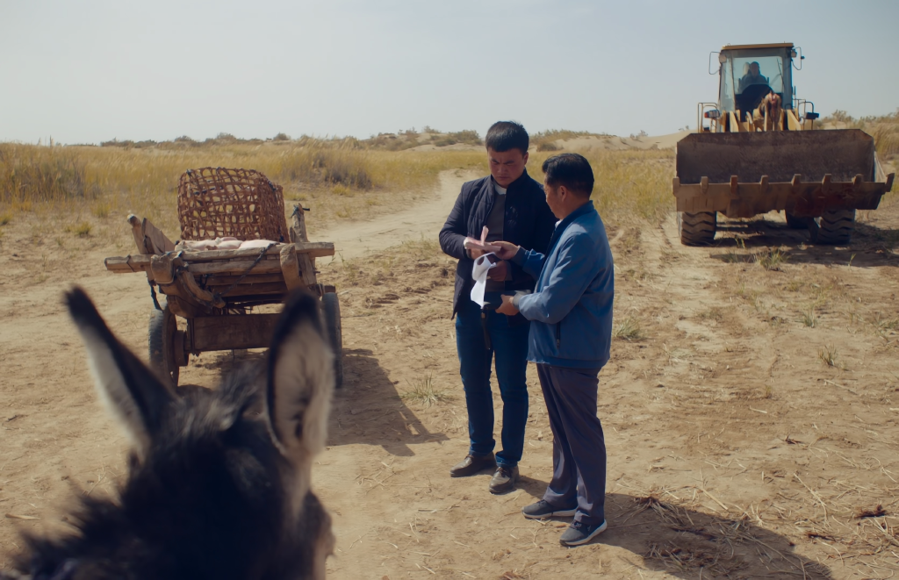
  最后推荐一本刘燕舞的《农民自杀研究》，在这本书中深刻地探讨和解释了各个地区和年龄段农民自杀的原因，也许能更好地帮助我们理解电影的结尾。

对镰刀，麦子能说个啥。

对啄它的麻雀儿，麦子它能说个啥。

对磨，麦子它能说个啥。

被当成种子，麦子又能说个啥。


